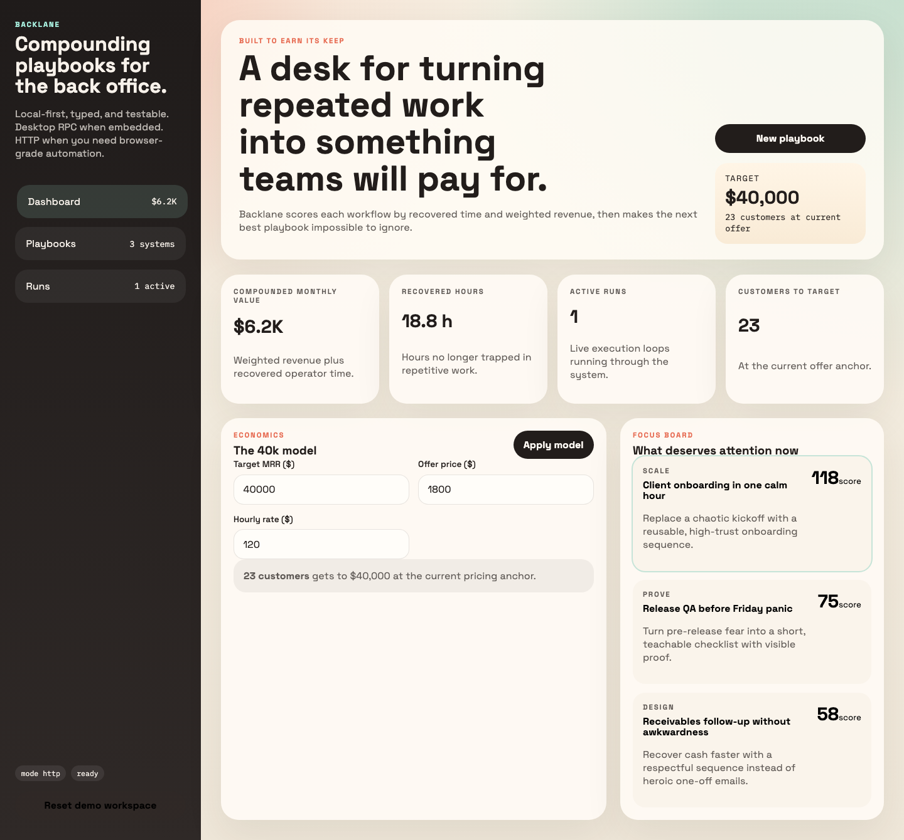
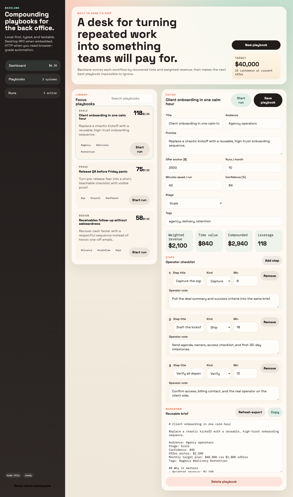
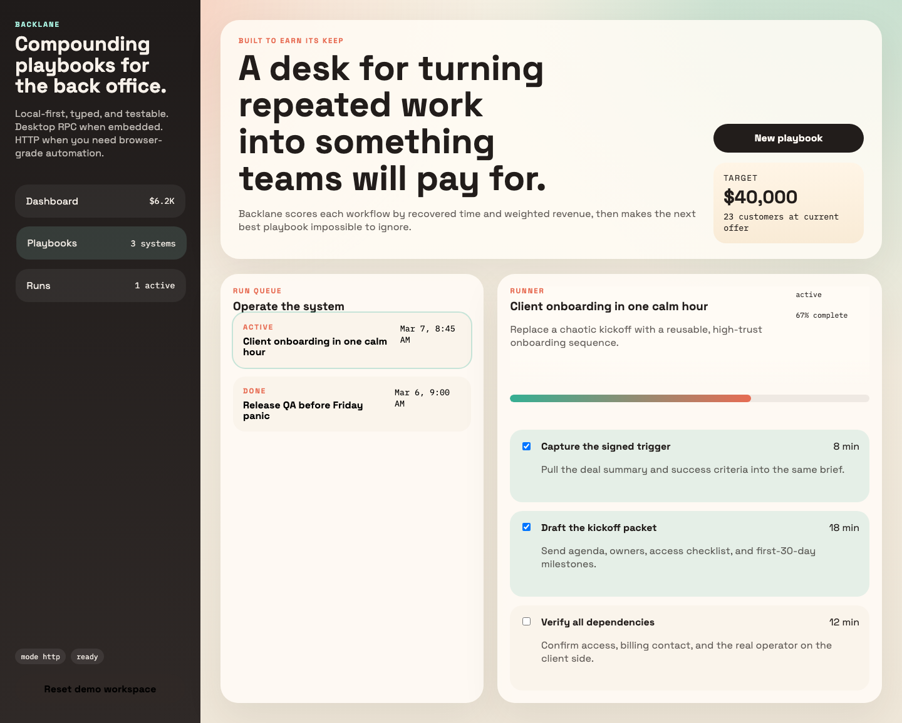
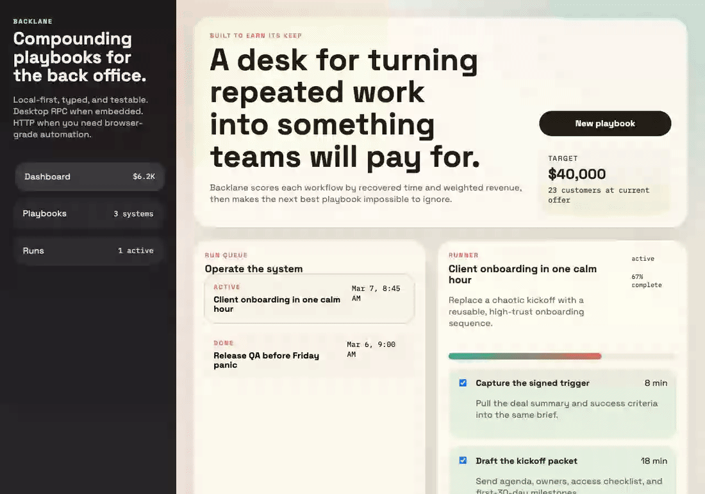

# Backlane


Backlane is a local-first desktop app for turning recurring back-office work into profitable playbooks. It is built with Electrobun, uses a Bun + SQLite backend, and ships with browser-grade automation through Playwright, Cypress, and Maestro.

It does not claim to guarantee `$40k` MRR. It does aim at a category where teams already spend real money on workflow capture and execution, then pushes toward a sharper niche: playbooks scored by leverage, attached to operator runs, and optimized around what compounds.



## Why this can sell

- Teams already pay for workflow documentation and execution tools.
- Backlane positions around a sharper promise: find the highest-leverage recurring process, quantify it, then run it.
- The local-first desktop angle matters for operators who do not want sensitive process knowledge trapped in a browser-only SaaS.

As of March 7, 2026:

- Scribe’s pricing page shows a `$59/month` team plan for 5 users and `$12` per additional user.
- Process Street’s pricing page presents startup, pro, and enterprise workflow plans through sales-led pricing.

See [research notes](./docs/research.md).

## Product

Backlane is an operations cockpit with three surfaces:

- `Dashboard`: a revenue model, leverage metrics, and a focus board.
- `Playbooks`: a structured editor for audience, promise, economics, steps, and markdown export.
- `Runs`: executable checklists that turn a documented process into live operator work.

## Screens








## Stack

- Electrobun desktop shell with Bun main process and system webviews
- React renderer with a dual gateway:
  HTTP for browser automation, RPC for desktop mode
- Bun SQLite persistence with immutable aggregate writes
- Pure domain projections for leverage scoring and markdown export

## Quick Start

```bash
bun install
bun run dev:hmr
```

Useful commands:

```bash
bun test
bun run test:playwright
bun run test:cypress
JAVA_HOME=/opt/homebrew/opt/openjdk@17/libexec/openjdk.jdk/Contents/Home \
PATH=/opt/homebrew/opt/openjdk@17/libexec/openjdk.jdk/Contents/Home/bin:$PATH \
bun run test:maestro
bun run docs:assets
```

## Docs

- [Architecture](./docs/architecture.md)
- [Testing](./docs/testing.md)
- [Research](./docs/research.md)

## Repository Shape

```text
src/
  bun/         Electrobun bootstrap + RPC bridge
  server/      Bun HTTP API + SQLite workspace store
  shared/      Immutable domain model, projections, seeds
  mainview/    React renderer and browser/RPC gateway
playwright/    Browser E2E coverage
cypress/       Browser regression coverage
maestro/       Web smoke flow
scripts/       Documentation asset generation
```
